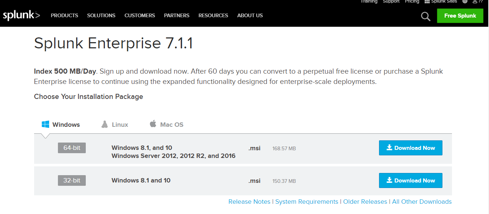
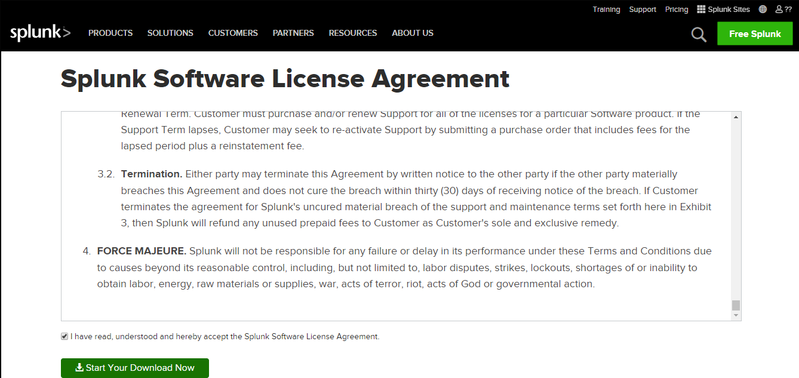
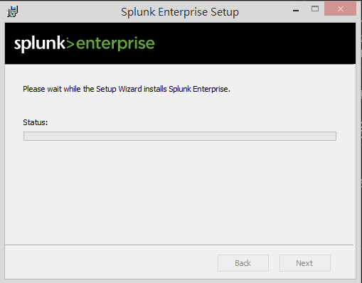
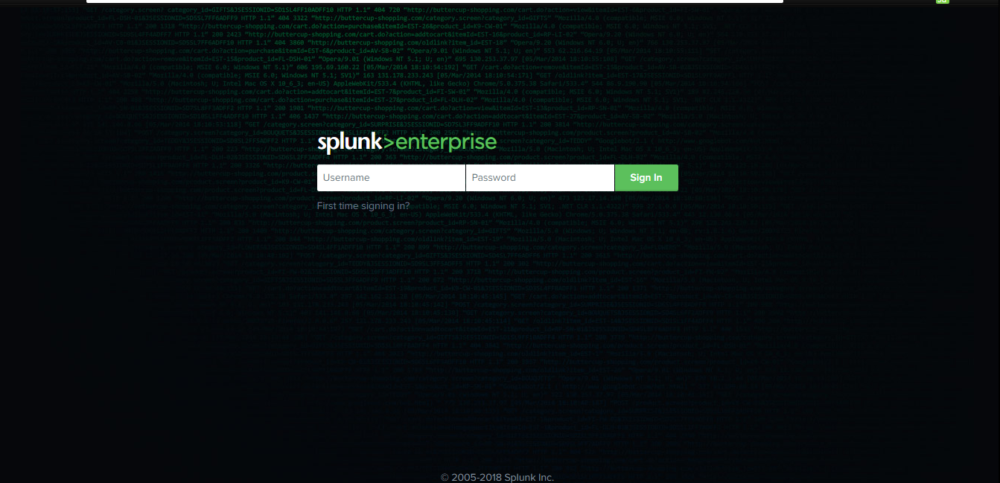
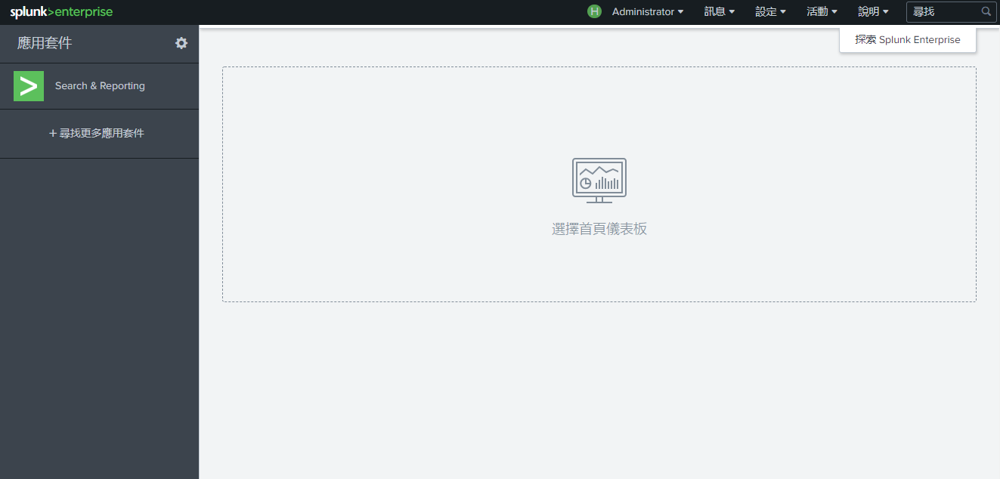

# Splunk 安裝並啟動


# 下載檔案

首先到官網[下載](https://www.splunk.com/en_us/download/splunk-enterprise.html)檔案，在下載之前需要先申請會員。

根據自身系統選擇所需要的 splunk 主程式下載，我自己電腦是 windows 64位元，所以我選擇第一個來做下載。

 

 

這裡有分免費版與企業版，兩者最大的差異是每日資料儲存量、定期排程執行、告警的功能，每日資料儲存量這裡用 License 稱呼，免費版 License 是500mb/天，超過額度的話會出現錯誤訊息甚至無法顯示圖表等等，但資料還是會持續進到 Index 的，別擔心。

免費版與企業版[完整差異表](https://www.splunk.com/en_us/products/splunk-enterprise/free-vs-enterprise.html)

# 安裝

Window 版安裝相當簡單，雙擊讓安裝精靈引導就好，一直下一步下一步安裝即可，跑完就可以了。之後就等他跑完。

 


# 啟動

安裝完後，開啟瀏覽器輸入下方指令，會出現下方登入頁面。

```
localhost:8000
```


根據自己的帳號密碼進行登入，登入後頁面如下瑣示。就可以開始嘗試詳做的事情惹~~~~

 