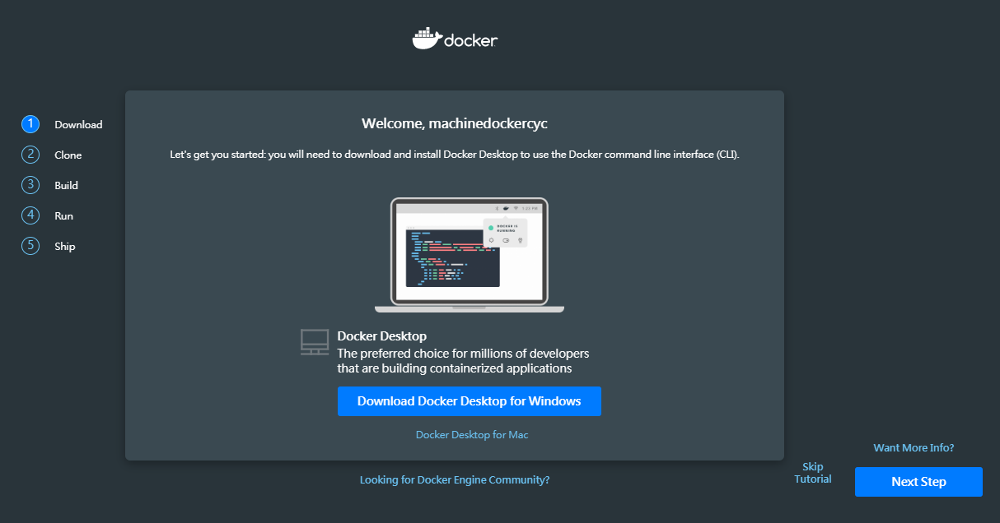
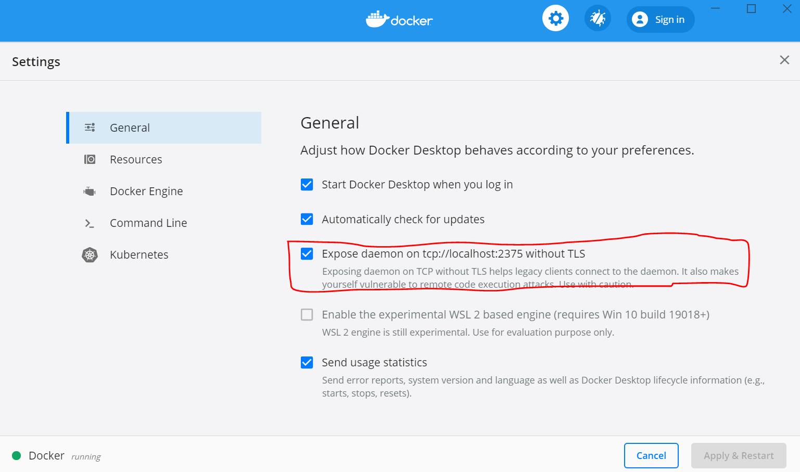

# Install Docker

## Linux

```
# 安裝一些必備軟體包，這些apt軟體包可以通過HTTPS使用軟體包
sudo apt install apt-transport-https ca-certificates curl software-properties-common

# 官方Docker存儲庫的GPG密鑰添加到您的系統中
curl -fsSL https://download.docker.com/linux/ubuntu/gpg | sudo apt-key add -

# 將Docker存儲庫添加到APT源
sudo add-apt-repository "deb [arch=amd64] https://download.docker.com/linux/ubuntu bionic stable"

# 安裝docker
sudo apt update
apt-cache policy docker-ce # 確保docker 是從 docker 除存庫來而不是從ubuntu
sudo apt install docker-ce

sudo usermod -aG docker $USER # 避免每次都sudo
```

## Windows Subsystem (WSL2)

wsl2 已經完整使用 linux 內核了，所以安裝方式跟 linux 會一樣，指令如下:

```
# 信任 Docker 的 GPG 公鑰：
curl -fsSL https://download.docker.com/linux/ubuntu/gpg | sudo apt-key add -

# 對於 amd64 架構的計算機，添加微軟倉庫：
sudo add-apt-repository \
   "deb [arch=amd64] https://mirrors.tuna.tsinghua.edu.cn/docker-ce/linux/ubuntu \
   $(lsb_release -cs) \
   stable"

# 安装 docker
sudo apt-get update
sudo apt-get install docker-ce

# 目前的使用者身分沒有權限去存取 docker engine, 因為 docker 的服務基本上都是以 root 的身分在執行的, 所以在指令前加 sudo 就能成功執行指令。但每次新藥打 sudo 很麻煩，透過下列指令可避免

sudo usermod -aG docker $USER

# 啟動 docker
sudo service docker start
```

安裝過程中會出現，**建議使用 docker desktop for windows 20s 內按 Ctrl+C 退出**，如果要往下安裝需要等待 20s


安裝完後，檢查 docker 安裝是否正常

```
# 檢查 docker 是否啟動
service docker statu
ps aux|grep docker
```

- note:
    - WLS2 下通過 apt install docker-ce 命令安裝的 docker 無法啟動，因為 WSL2 方式的 ubuntu 裡面沒有 systemd。上述官方 get-docker.sh 安裝的docker，dockerd 進程是用ubuntu傳統的 init 方式而非 systemd 啟動的。

## Windows Subsystem (WSL1)

- 手動開啟 windows Hyper-V
    - 設定 -> 應用程式與功能 -> 程式與功能 -> 開啟或關閉 Windows 功能 -> 點選 Hyper-V

- 到 Docker 官網下載 Windows 版的 Docker 安裝。[下載連結](https://www.docker.com/products/docker-desktop)。
    - 下載 docker 需要先申請一個 docker 帳號，有點類似 github，在 docker 稱作 Docker hub，可以在 docker hub 中察看其他 image。下載畫面如下:

    

- 在 WSL 上安裝 Docker

    ```
    sudo apt install docker.io
    sudo usermod -aG docker $USER
    ```
- 連接 WSL docker client 和 Windows 的 docker engine
    - WSL 本身無法支援 docker engine  (這也是為什麼要安裝 windows docker 的原因)

- 打開 Windows 下 Docker 的設定界面，將 Expose daemon on tcp://localhost:2375 without TLS 的選項打開。

    

- 打開 WSL 的 Bash，用編輯器修改 **~/.bashrc** 檔案，加入下列內容：
    ```
    PATH="$PATH:/mnt/c/Program\ Files/Docker/Docker/resources/bin"
    alias docker=docker.exe
    alias docker-machine=docker-machine.exe
    alias docker-compose=docker-compose.exe
    export DOCKER_HOST="tcp://localhost:2375"
    ```

- 在 sudoer 中加入 DOCKER_HOST 這個環境變數到預設環境中，先執行 **sudo visudo** 然後加入下面這一行：
    ```
    Defaults env_keep += "DOCKER_HOST"
    ```

- 重開 WSL 的 Bash (或是執行 source ~/.bashrc)

- WSL 執行 **docker run hellow-world**，會出現如下畫面:

    


## Windows

- 電腦無法裝

    - Windows: Docker Desktop requires Windows 10 Pro or Enterprise version 14393 to run
    - 本次 docker 安裝是在 windows8 環境下操作，不滿足基本環境需求


## Reference

- [Windows 10 WSL 2.0安装并运行Docker](https://www.cnblogs.com/yunfeifei/p/13158845.html)

- [在Ubuntu 18.04上安裝和使用Docker](https://kknews.cc/zh-tw/code/zyaz5qg.html)
