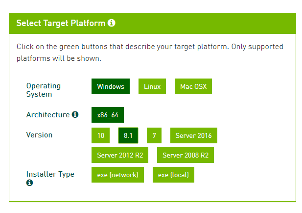
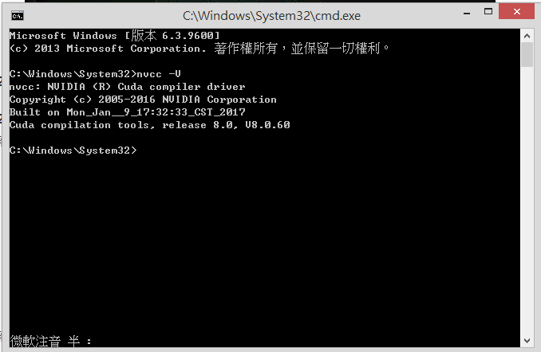
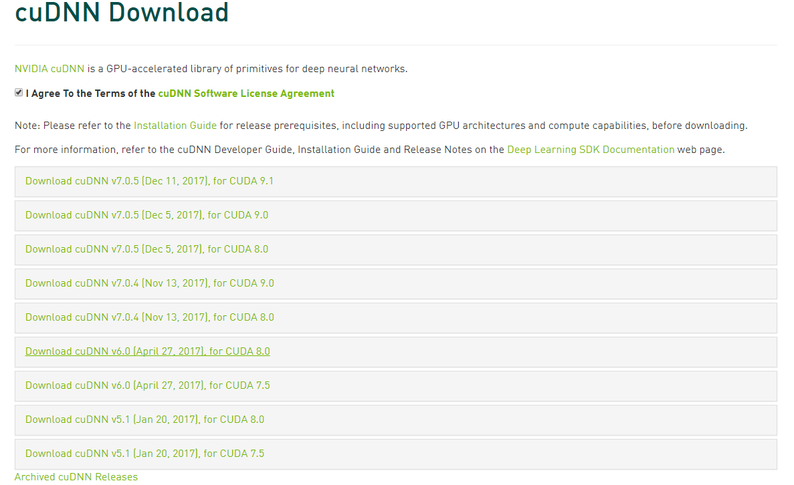
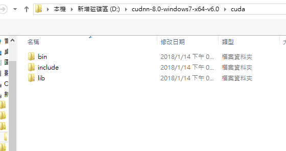

# windows 10 WSL2 安裝文件

## 官方網站教學文件

* [windows WSL2 CUDA 安裝文件](https://docs.nvidia.com/cuda/wsl-user-guide/index.html)

## 官方指令 cuda-toolkit-11-0 無法安裝，只好參考如下

* [win10 Linux子系统WSL2+CUDA11.0+ubuntu-tensorflow-pytorch环境配置](https://blog.csdn.net/xautzxc/article/details/107610353)

# windows 8 安裝文件

## 安装 NVIDIA CUDA Toolkit 和 cuDNN

- [CUDA](https://developer.nvidia.com/cuda-toolkit-archive):是由NVIDIA所推出的整合技術，統一計算架構CUDA（Compute Unified Device Architecture），CUDA 是 NVIDIA 的平行運算架構，可運用繪圖處理單元(GPU) 的強大處理能力，大幅增加運算效能。Nvidia 已售出數百萬顆 CUDA GPU，程式設計師、科學家等，將 CUDA 應用於各種領域，如影像處理、視訊處理、醫學診斷..等等。

- 驗證CUDA安裝成功，在cmd然後輸入“nvcc -V”，如果安裝正確的話你應該看到這樣的輸出：

- [cuDNN](https://developer.nvidia.com/rdp/cudnn-download): (CUDA Deep Neural Network library)是 NVIDIA 深度學習 SDK 的一部分，是 GPU 的深度學習程式庫。cuDNN 能為深度學習，提供高效能神經網絡層級，例如:卷積、池化和激活層..等等。

- 解壓縮我們下載的 CuDnn 文件，得到3個文件夾：bin, include, lib。

- 設定環境變數，將剛剛得到的文件路徑
D:\cudnn-8.0-windows7-x64-v6.0\cuda 和D:\cudnn-8.0-windows7-x64-v6.0\cuda\bin 增加到環境變數中。

Note:

1. Windows 不需要先安裝 gpu dirver。直接安裝 cuda 就會一起安裝

2. Ubuntu 18.04 更換 GPU 需先將 driver 移除，升級 gcc & g++ 到 7.3(最新版本)，再重新安裝新 GPU 的 driver

3. cuDnn 需要先登入才能下載

## Reference

* [Windows GPU dirver update](http://ofeyhong.pixnet.net/blog/post/212050369-%E3%80%90%E6%95%99%E5%AD%B8%E3%80%91%E6%9B%B4%E6%96%B0%E9%A1%AF%E7%A4%BA%E5%8D%A1%E9%A9%85%E5%8B%95%E7%A8%8B%E5%BC%8F)

* [Windows cuda9.0](https://www.deciphertechnic.com/fix-cuda-toolkit-installation/)

* [Ubuntu GPU driver](https://askubuntu.com/questions/1045241/ubuntu-18-04-how-do-i-install-drivers-for-my-nvidia-geforce-gtx-1050)

* [Ubuntu 18.04 + CUDA 9.0 + cuDNN + Tensorflow测试](https://blog.csdn.net/weixin_38056657/article/details/80948758)

* [Ubuntu install CUDA 9.0 相關文件](https://2formosa.blogspot.com/2017/07/debian8.8-cuda8.0-installation.html)