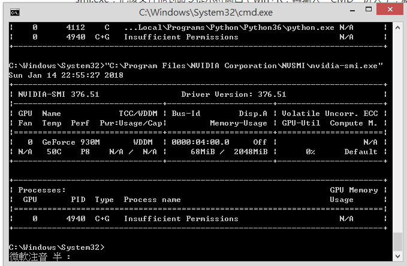
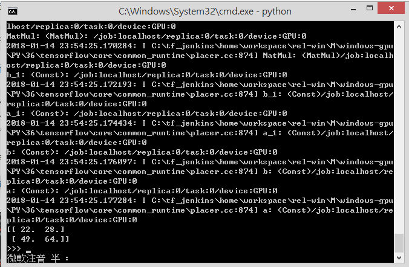

# TensorFlow GPU 執行環境安裝

## 使用環境

| os | nvidia-driver | cuda | cudnn | GPU | tensotflow | tensotflow-gpu |
| --- | --- | --- | --- |--- |--- |--- |
| ubuntu 18.04 (64) | 450.36 | 10.1 | 7.6.5 | GeForce 1060(6G) | 2.2.0 | 2.2.0 |
| ubuntu 18.04 (64) | 390.48 | 9.0 | 7.0 | GeForce 1060(6G) | 1.10.0 | 1.10.0 |
| ubuntu 18.04 (64) | 390.48 | 9.0 | 7.0 | GeForce 1050(2G) | 1.10.0 | 1.10.0 |
| windows 8.1 (64) | 385.54 | 9.0 | 7.0 | GeForce 930M(2G) | 1.11.0 | 1.11.0 |
| windows 8.1 (64) | 376.51 | 8.0 | 6.0 | GeForce 930M(2G) | 1.4.0 | 1.4.0 |

## TensorFlow GPU 版本說明

TensorFlow 要利用 GPU 強大的平行運算功能，必須安裝TensorFlow GPU 版本。 Tensorflow GPU 版本:主要是透過 NVIDIA 提供的 CUDA 和 CudNN，才能運用 GPU 執行深度學習訓練。

## 顯示卡要求

要使用 NVIDIA GPU 加速 TensorFlow，首先要有支持 CUDA Compute Capability 3.0 以上的 NVIDIA GPU 設備。 CUDA 是 NVIDIA 推出的一套並行計算平台和 API，NVIDIA 各產品的支持情況可以在[這裡](https://developer.nvidia.com/cuda-gpus)找到。

## 兼容性問題

- python3.6 + cuda8 + cuDNN6
- python3.5 + cuda8 + cuDNN6

一般在 python3.5 的組合下，需要 Micrsolft Visual C++ 2015 Redistributable，但在 python3.6 需要的是 Micrsolft Visual C++ 2017 Redistributable。本身嘗試了第一個組合是可行的而且過程似乎也比較容易。

## 安装 NVIDIA CUDA Toolkit 和 cuDNN

- [CUDA](https://developer.nvidia.com/cuda-toolkit-archive):是由NVIDIA所推出的整合技術，統一計算架構CUDA（Compute Unified Device Architecture），CUDA 是 NVIDIA 的平行運算架構，可運用繪圖處理單元(GPU) 的強大處理能力，大幅增加運算效能。Nvidia 已售出數百萬顆 CUDA GPU，程式設計師、科學家等，將 CUDA 應用於各種領域，如影像處理、視訊處理、醫學診斷..等等。


- 驗證CUDA安裝成功，在cmd然後輸入“nvcc -V”，如果安裝正確的話你應該看到這樣的輸出：


- [cuDNN](https://developer.nvidia.com/rdp/cudnn-download): (CUDA Deep Neural Network library)是 NVIDIA 深度學習 SDK 的一部分，是 GPU 的深度學習程式庫。cuDNN 能為深度學習，提供高效能神經網絡層級，例如:卷積、池化和激活層..等等。


- 解壓縮我們下載的 CuDnn 文件，得到3個文件夾：bin, include, lib。


- 設定環境變數，將剛剛得到的文件路徑
D:\cudnn-8.0-windows7-x64-v6.0\cuda 和D:\cudnn-8.0-windows7-x64-v6.0\cuda\bin 增加到環境變數中。

## 安裝 TensorFlow GPU 版本

- 在 CMD 輸入 "pip3 install tensorflow-gpu"。如果之前已經安裝過 tensorflow ，切記 CPU 和 GPU 版本要相同。

- 查看 GPU 使用狀況。在文件夾 C:\Program Files\NVIDIA Corporation\NVSMI 裡找到文件 nvidia-smi，把該文件拖到 CMD。就可以顯示關於GPU的信息，如下圖所示：



## 測試 tensotflow GPU

打開cmd，輸入以下指令打開 python 的 interactive shell。

首先導入 tensorflow:

```python
import tensorflow as tf
```

依序完成下列程式，應該可以看到下圖中表明你的GPU已經開始工作啦。

```python
a = tf.constant([1.0, 2.0, 3.0, 4.0, 5.0, 6.0], shape=[2, 3], name='a')
b = tf.constant([1.0, 2.0, 3.0, 4.0, 5.0, 6.0], shape=[3, 2], name='b')
c = tf.matmul(a, b)

sess = tf.Session(config=tf.ConfigProto(log_device_placement=True))

print(sess.run(c))
```




Note:

1. Windows 不需要先安裝 gpu dirver。直接安裝 cuda 就會一起安裝

2. Ubuntu 18.04 更換 GPU 需先將 driver 移除，升級 gcc & g++ 到 7.3(最新版本)，再重新安裝新 GPU 的 driver

3. cuDnn 需要先登入才能下載


## Reference

* [Windows GPU dirver update](http://ofeyhong.pixnet.net/blog/post/212050369-%E3%80%90%E6%95%99%E5%AD%B8%E3%80%91%E6%9B%B4%E6%96%B0%E9%A1%AF%E7%A4%BA%E5%8D%A1%E9%A9%85%E5%8B%95%E7%A8%8B%E5%BC%8F)

* [Windows cuda9.0](https://www.deciphertechnic.com/fix-cuda-toolkit-installation/)

* [Ubuntu GPU driver](https://askubuntu.com/questions/1045241/ubuntu-18-04-how-do-i-install-drivers-for-my-nvidia-geforce-gtx-1050)

* [Ubuntu 18.04 + CUDA 9.0 + cuDNN + Tensorflow测试](https://blog.csdn.net/weixin_38056657/article/details/80948758)

* [Ubuntu install CUDA 9.0 相關文件](https://2formosa.blogspot.com/2017/07/debian8.8-cuda8.0-installation.html)