# VirtualBox 安裝

一般在建立 hadoop cluster 叢集時，需要多台電腦。為了讓一般大眾可以模擬這情況，
我們先介紹 VirtualBox 利用 VirtualBox 虛擬機器軟體創造出多台實體機器的樣子。

[VirtualBox 下載載點](https://www.virtualbox.org/wiki/Downloads)

進入載點會出現如下畫面，由於我的電腦是 windows，所以選擇 windows hosts 來做安裝。

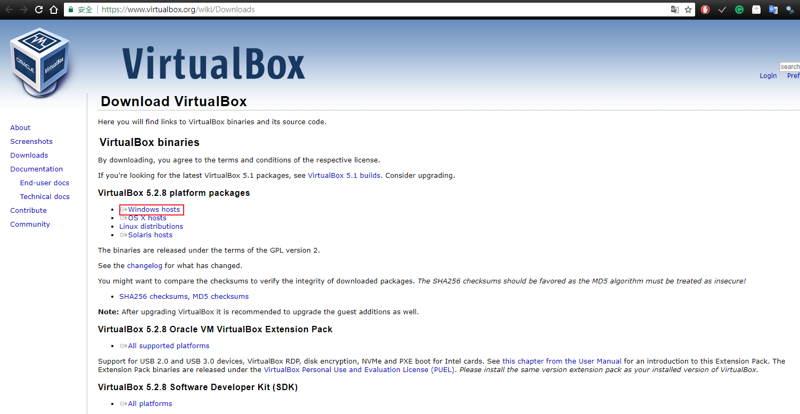

下載完後開始安裝，直接按下 next 。

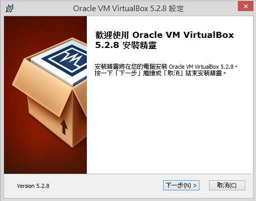

選擇安裝位置，然後一直按下 next。

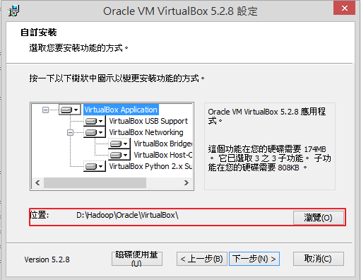

這個畫面只是警告，說明安裝時會暫時中斷網路，直接按 Y。

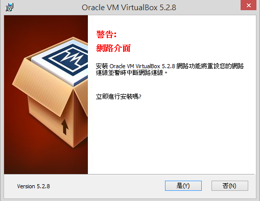

開始安裝。

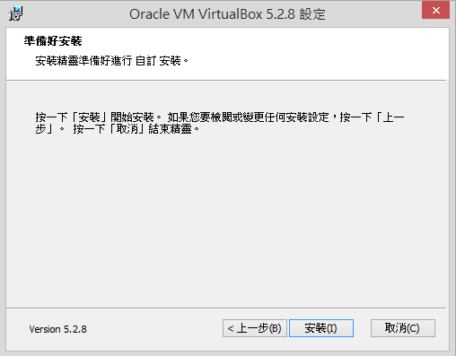

目前不知道這東西的功能(但選擇安裝了)

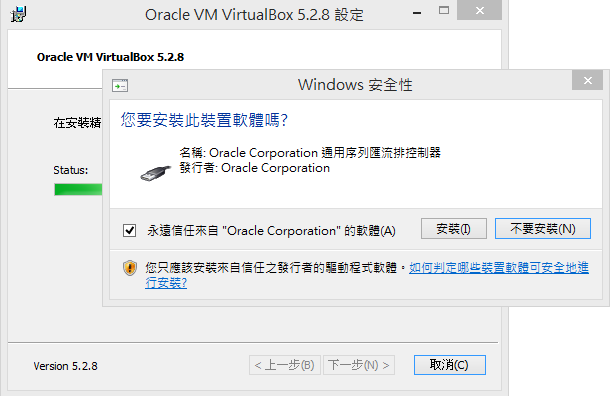

安裝完成，按完成就會啟動 VirtualBox。

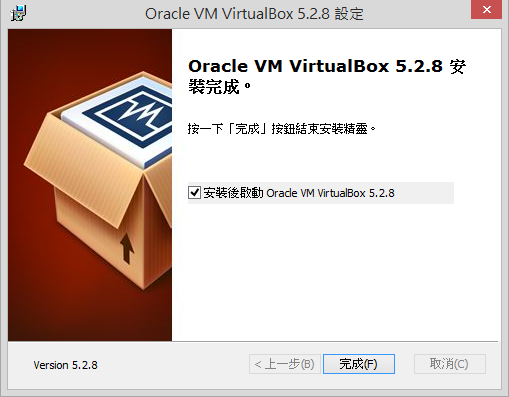

當建立虛擬主機時，Virtual Box 會幫你建立一個檔案，用於儲存此虛擬主機的所有資料，所以建立選擇空間比較大的硬碟。

設定 Virtual Box 儲存資料夾。按檔案->喜好設定。

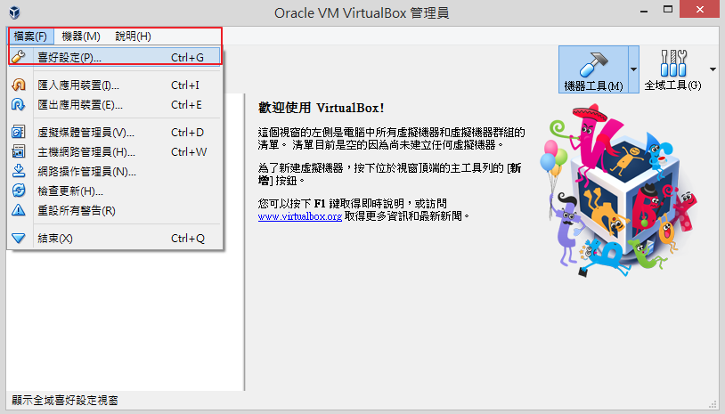

選擇一般->預設機器資料夾->其他->設定要儲存 VirtualBox 虛擬機器檔案資料夾，然後按確定。

接下來，要新增一台虛擬機器。回到 VirtualBox 啟動後的畫面點選新增，然後輸入機器名稱，選擇類型，選擇版本，然後按下一步。

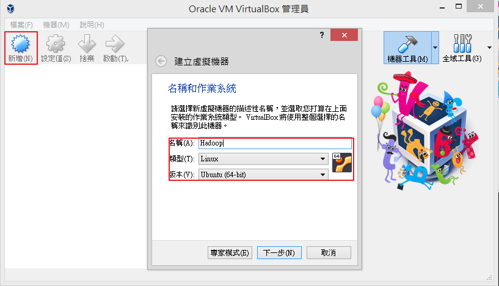

設定虛擬機器記憶體大小，然後按下一步。

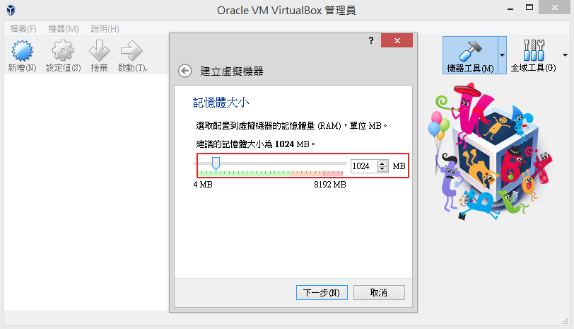

選擇立即建立虛擬機器硬碟，然後下一步。

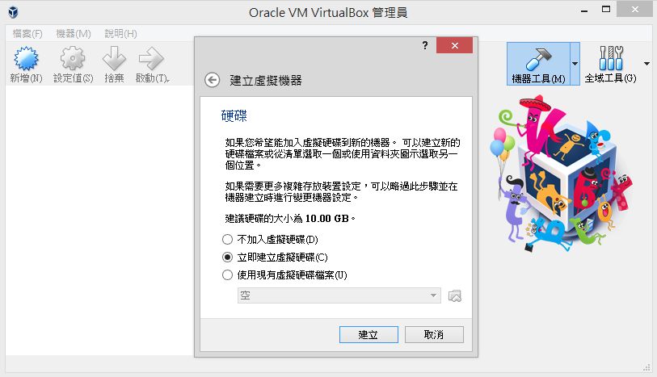

選擇虛擬硬碟檔案格式，選擇預設 VDI，然後按下一步。

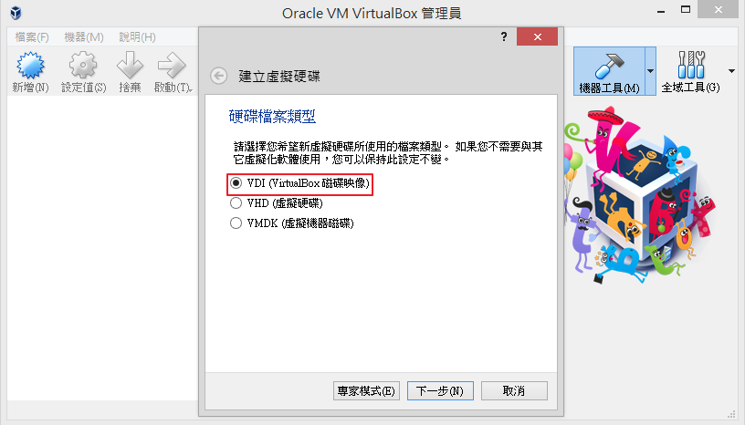

設置虛擬機硬碟配置方式。選擇動態配置，動態配置的好處是不用擔心會佔用太多硬碟空間。檔案會隨著虛擬機器擴增，慢慢增加檔案大小。

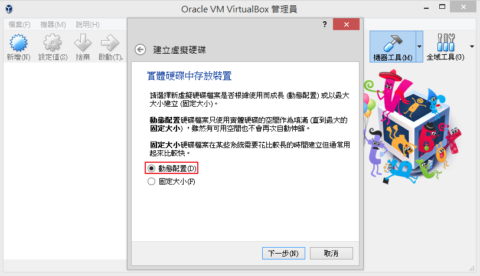

設定虛擬機器硬碟檔案位置及大小。檔案會建立在之前所設定的預設資料夾。硬碟大小上限值為100G，然後按建立即完成。

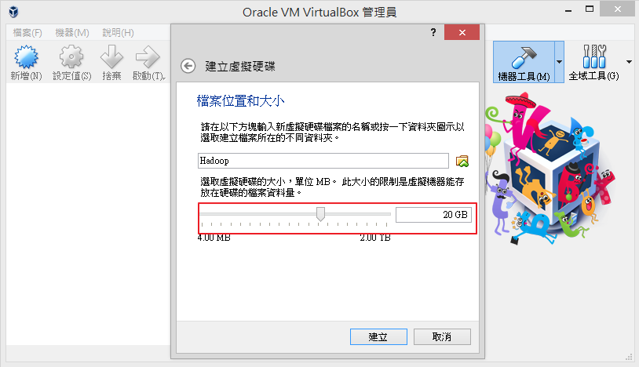

建立完成後，就可以看到左邊會有虛擬機器圖示。

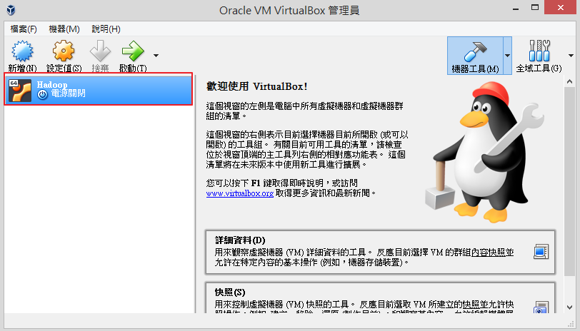