# 安裝 Hadoop Single Node Cluster


## 安裝 JDK

因為 hadoop 是以 java 開發，所以必須先安裝 java 環境。

* 開啟終端機，查看 java 版本
```
java -version
``` 
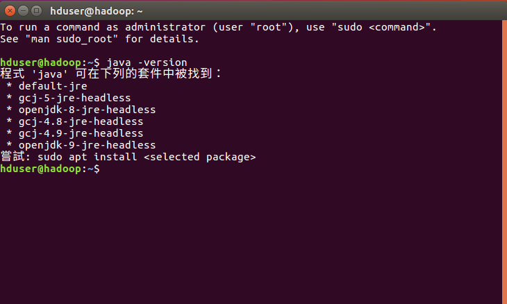

Linux 可使用 apt 進行套件管理，也可以使用 apt-get 下載安裝軟體套件。所以我們使用 apt-get 安裝 jdk。由於要執行 apt-get 必須使用 superuser 權限，為避免執行到不該執行的東西，我們在命令前面加上 sudo 指令，這樣就可以謹慎的使用 superuser 權限。

執行此指令會連線至 APT Sever，更新最新套件資訊。
```
sudo apt-get update
``` 
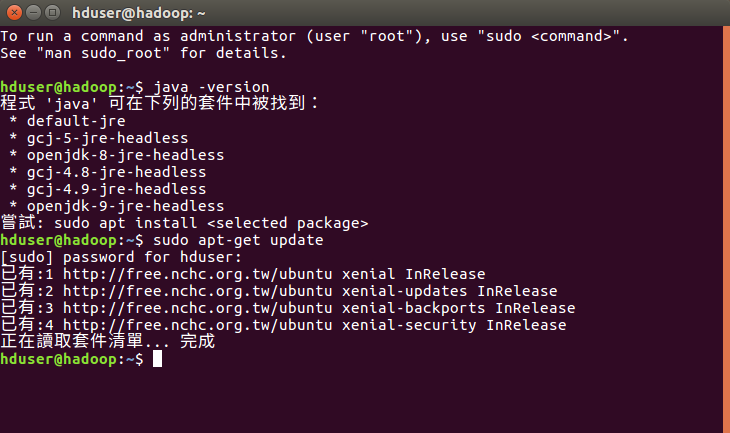

* 安裝 JDK

執行後系統會詢問會占用記憶體空間，輸入Y繼續即可。
```
sudo apt-get install default-jdk
``` 
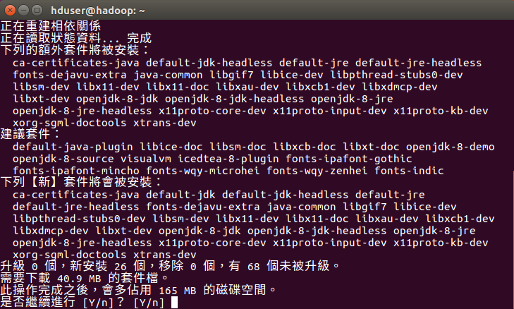

* 查詢 java 安裝位置
```
update-alternatives --display java
``` 
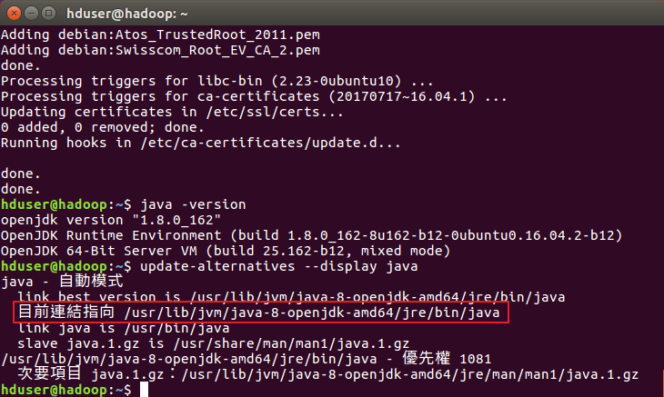

由上圖可已得知安裝在 /usr/lib/jvm/java-8-openjdk-amd64。稍後會在 ~/.bashrc檔案中，設定此路徑。


## 設定 SSH 無密碼登入

hadoop 是由很多台伺服器所組成。當我們啟動 hadoop 系統時，NameNode 必須與 DataNode 連線，並管理這些節點(DataNode)。因此透過 ssh 來進行身分驗證。

* 安裝 ssh

執行後系統會詢問會占用記憶體空間，輸入Y繼續即可。
```
sudo apt-get install ssh
``` 
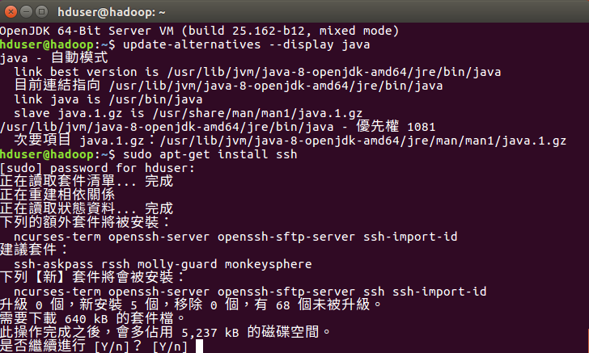

* 安裝 rsync 
```
sudo apt-get install rsync
``` 
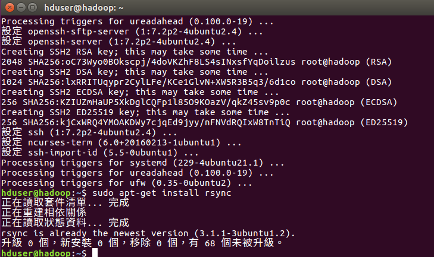

* 產生 ssh key
```
ssh-keygen -t dsa -P " -f ~/.ssh/id_dsa
``` 
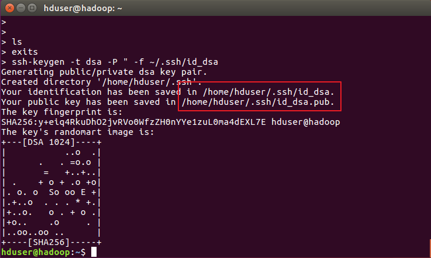

* 查看產生的 ssh key
```
ll ~/.ssh
``` 
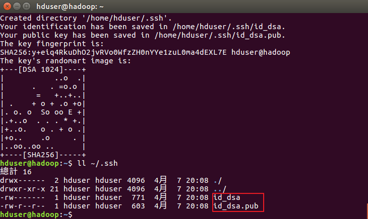

* 將產生的 key 放置授權檔案

為了能夠無密碼登入本機，我們必須將產生的 key 加入到授權的檔案中。執行後會將 ~/.ssh/id_dsa.pub 附加到 ~/.ssh/authorized_keys 授權檔之後 。
```
cat ~/.ssh/id_dsa.pub >> ~/.ssh/authorized_keys
``` 
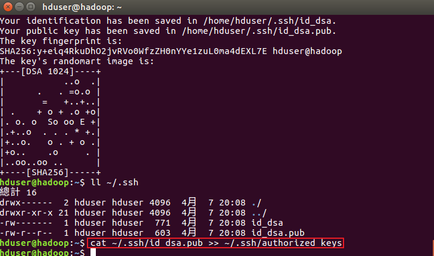


## 下載安裝 hadoop

* 連結至下載頁面

直接到 [hadoop 官方網站](http://www.apache.org/dyn/closer.cgi/hadoop/common/hadoop-2.6.4/hadoop-2.6.4.tar.gz)下載 hadoop2.6.4 為後續跟 spark2.0 做搭配。

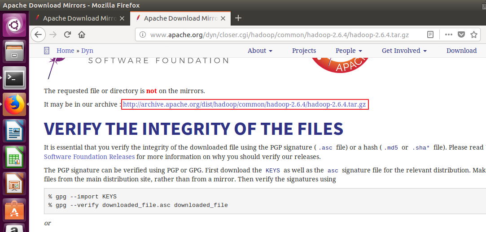

* 執行下載命令

點選上圖紅框處，複製連結。然後在終端機先輸入 wget 之後將連結貼上。
```
wget http://archive.apache.org/dist/hadoop/common/hadoop-2.6.4/hadoop-2.6.4.tar.gz
```

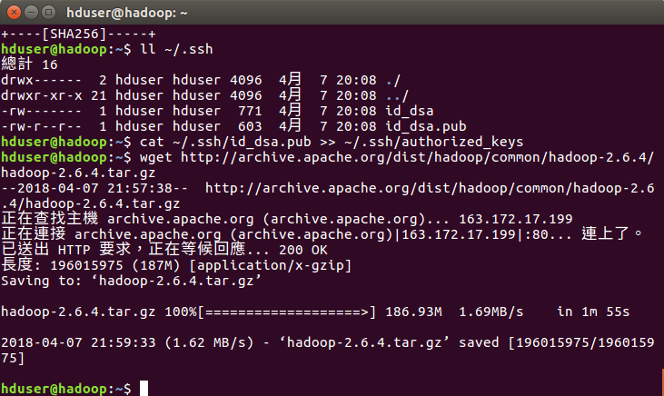

* 解壓縮 hadoop2.6.4

解壓縮 hadoop-2.6.4.tar.gz 至 hadoop-2.6.4 目錄。
```
sudo tar -zxvf hadoop-2.6.4.tar.gz
```

* 搬移 hadoop 至 /usr/local

軟體預設的安裝路徑就是在 /usr/local，在終端機輸入下面指令。搬移 hadoop-2.6.4 目錄至 /usr/local/hadoop。
```
sudo mv hadoop-2.6.4 /usr/local/hadoop
```

* 查看 hadoop 安裝目錄 /usr/local/hadoop
```
ll /usr/local/hadoop
```
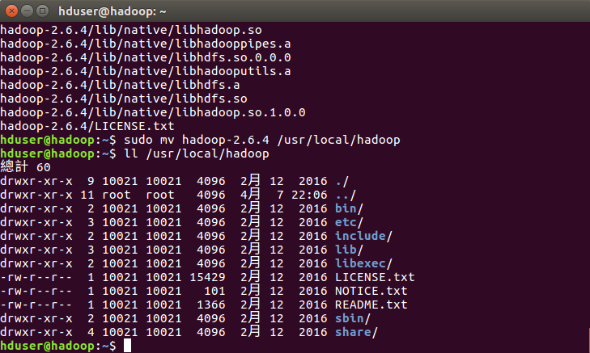

常用目錄說明:
  * bin/:   各執行檔，包含 hadoop、hdfs、yarn 等
  * sbin/:  各 shell 執行檔，包括 start-all.sh，stop-all.sh
  * etc/:   etc/hadoop 子目錄包含 hadoop 設定檔，例如:hadoop-env.sh、core-site.xml、yarn-site.xml、mapred-site.xml、hdfs-site.xml
  * lib/:  hadoop 函式庫
  * logs/: 系統日誌；查看系統執行狀況


## 設定 hadoop 環境變數

為了避免每次登入 hadoop 都重新設定環境變數，我們將所有設定環境變數的檔案放在 ~/bashrc 中。

* 編輯 ~/.bashrc
```
sudo gedit ~/.bashrc
```
執行完上述指令，會出現如下畫面。

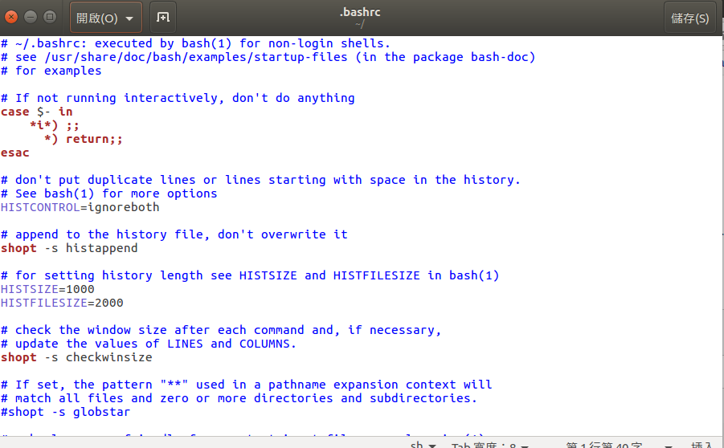

並輸入下面紅框處的設定。

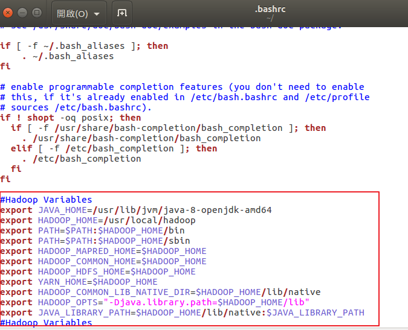

* 讓 ~/.bashrc 修改的設定值生效
```
source ~/.bashrc
```


## 修改 hadoop 組態設定檔

hadoop 組態設定，包刮:hadoop-env.sh、core-site.xml、yarn-site.xml、mapred-site.xml、hdfs-site.xml。

* 設定 hadoop-env.sh 組態檔

hadoop-env.sh 是 hadoop 的組態檔，必須先設定 java 的安裝路徑。
```
sudo gedit /usr/local/hadoop/etc/hadoop/hadoop-env.sh
```

輸入上述指令，會出下如下畫面，修改 JAVA_HOME 設定成下圖內容。原檔案設定是 export JAVA_HOME=${JAVA_HOME}。

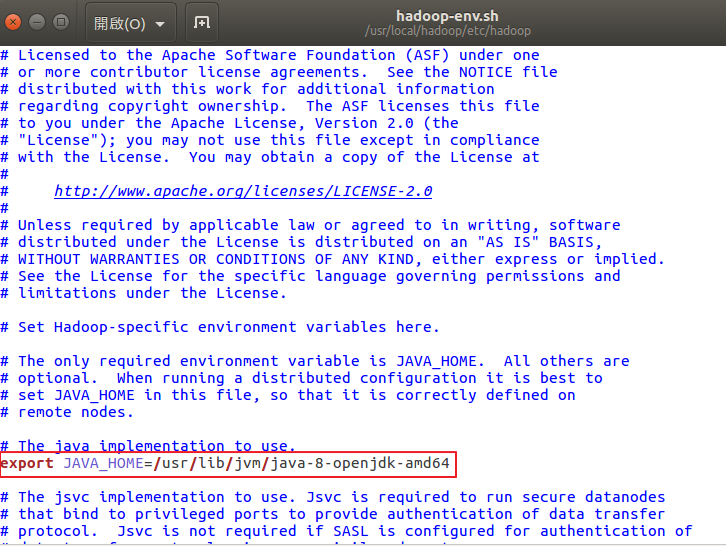

編輯完後儲存然後關閉。

* 設定 core-site.xml

在 core-site.xml 我們必須設定 HDFS 的預設名稱，當我們使用命令或程式要存取 HDFS 時，可使用此名稱。
```
sudo gedit /usr/local/hadoop/etc/hadoop/core-site.xml
```

輸入上述指令，會出下如下畫面，修改 configuration 之間，設定成下圖內容(設定 HDFS 的預設名稱)。

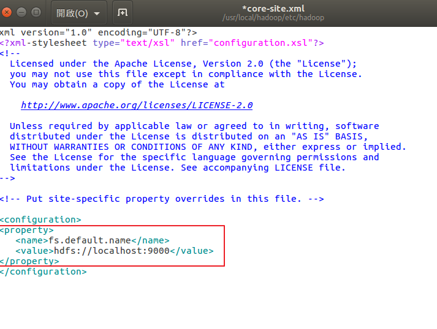

編輯完後儲存然後關閉。

* 設定 yarn-site.xml
```
sudo gedit /usr/local/hadoop/etc/hadoop/yarn-site.xml
```


編輯完後儲存然後關閉。

* 設定 mapred-site.xml

mapred-site.xml 用於設定監控 Map 與 Reduce 程式的 JobTracker 工作分配以及 TaskTracker 工作執行狀況。Hadoop 提供了設定樣板檔案，可以自行複製修改。

複製樣本檔案，由 mapred-site.xml.template 至 mapred-site.xml
```
sudo cp /usr/local/hadoop/etc/hadoop/mapred-site.xml.template /usr/local/hadoop/etc/hadoop/mapred-site.xml
```

編輯 mapred-site.xml
```
sudo gedit /usr/local/hadoop/etc/hadoop/mapred-site.xml
```

輸入上述指令，會出下如下畫面，修改 configuration 之間，設定成下圖內容(設定 mapreduce 框架為 yarn)。

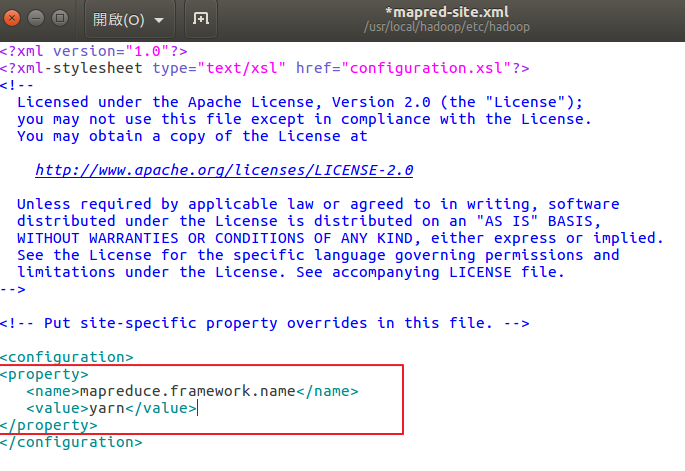

編輯完後儲存然後關閉。

* 設定 hdfs-site.xml

hdfs-site.xml 用於設定 HDFS 分散式檔案系統。
```
sudo gedit /usr/local/hadoop/etc/hadoop/hdfs-site.xml
```

輸入上述指令，會出下如下畫面，修改 configuration 之間，設定成下圖內容(設定 blocks 副本備份數、設定 NameNode 資料儲存目錄、設定 DataNode 資料儲存目錄)。

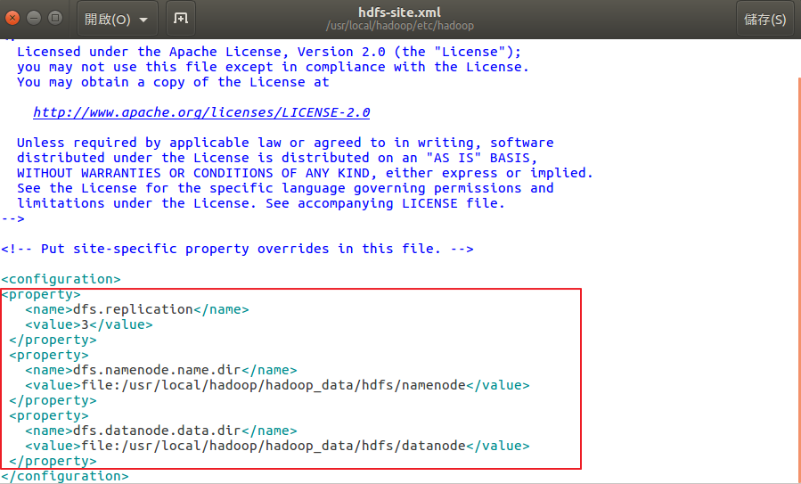

編輯完後儲存然後關閉。


## 建立與格式化 HDFS 目錄

* 建立 namenode、datanode 資料儲存目錄

建立 NameNode 資料儲存目錄
```
sudo mkdir -p /usr/local/hadoop/hadoop_data/hdfs/namenode
```

建立 DataNode 資料儲存目錄
```
sudo mkdir -p /usr/local/hadoop/hadoop_data/hdfs/datanode
```

將 hadoop 目錄的擁有者更改為 hduser。Linux 是多人工業系統，所有的目錄或檔案皆具擁有者。利用 chown 可以將目錄或檔案的擁有者更改為 hduser。
```
sudo chown hduser:hduser -R /usr/local/hadoop
```

* 格式化 namenode

將 HDFS 進行格式化。需要特別注意!如果 HDFS 已經有資料，執行 HDFS 格式化會刪除所有資料。
```
hadoop namenode -format
```

執行結果如下。

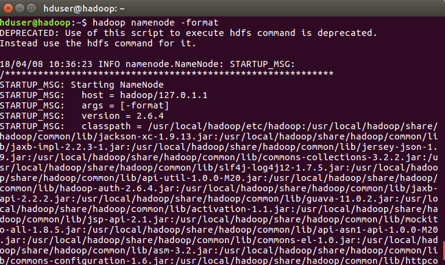


## 啟動 Hadoop

上列步驟已經完成 Hadoop Single Node Cluster 安裝。啟動 Hadoop 有兩種方式。

1. 分別啟動 HDFS、Yarn，使用 start-dfs.sh(啟動HDFS)、start-yarn.sh(啟動 Yarn)。
2. 同時啟動 HDFS、Yarn，使用 start-all.sh

* 啟動 HDFS

第一次啟動會詢問是否繼續連線，請輸入 yes。
```
start-all.sh
```

* 使用 jps 查看已經啟動的行程

jps (java Virtual Machine Process Status Tool)，可以查看目前所有執行的行程 (process)
```
jps
```
執行結果如下，因為只有一台伺服器，所以所有功能都在一台伺服器中，可以看到:
  1. HDFS 功能: Namenode、Secondary NameNode、datanode 已經啟動。
  2. MapReduce2 (YARN): Resource Manager、Node Manager 已經啟動。


## Hadoop ResourceManager Web 介面

Hadoop ResourceManager Web 可以查看目前 hadoop 狀態: Node 節點、應用程式、排程執行狀態。

* 開啟 Hadoop ResourceManager Web 介面[網址](http://localhost:8088)

執行結果如下。

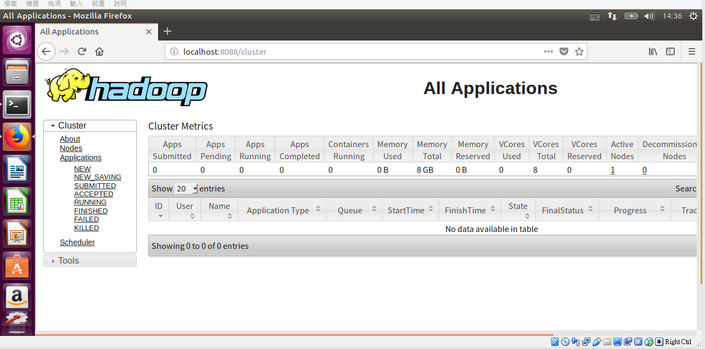

* 查看已經執行的節點 Nodes

點選左邊紅框 Nodes，會顯示目前的節點。不過因為我們目前只安裝 Single Node Clister，所以只有一個。

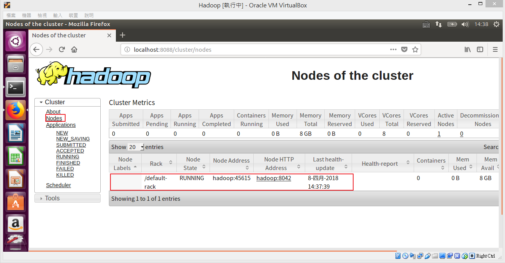


## NameNode HDFS Web 介面

HDFS Web 介面可以檢查目前 HDFS 與 DataNode 執行情形。

* 開啟 NameNode HDFS Web 介面[網址](http://localhost:50070)

執行結果如下。

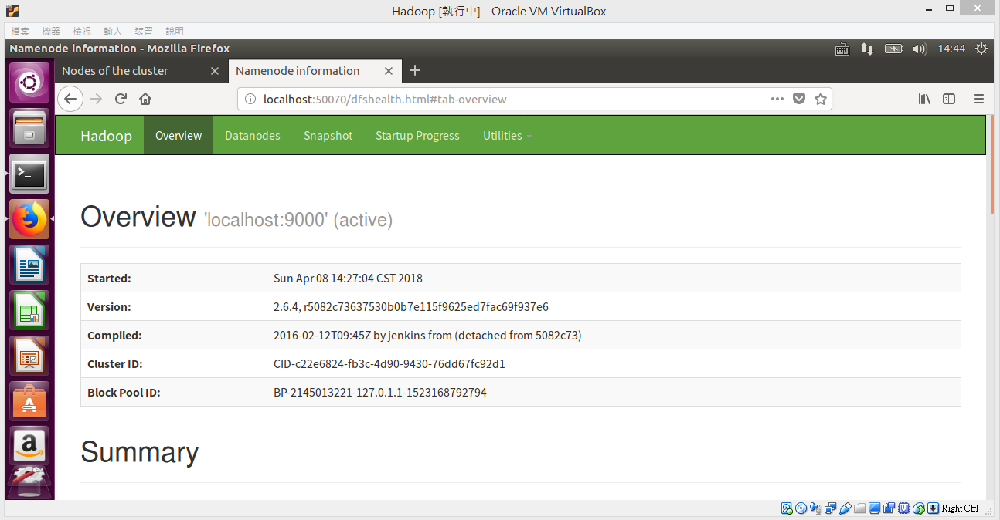

* 查看 Live Nodes

點選下方紅框處。

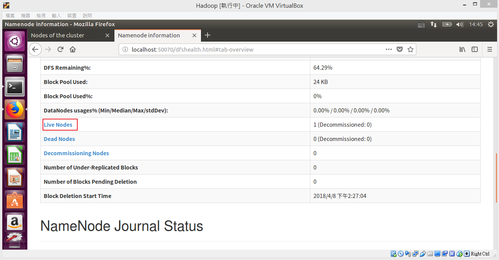

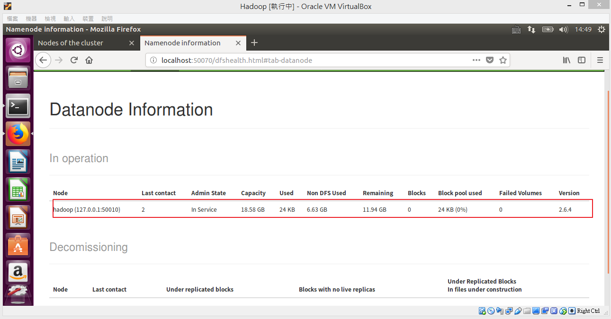
