# 安裝 Hadoop Multi Node Cluster

Hadoop Multi Node Cluster 主要概念:

* 由多台電腦組成: 有一台主要的電腦 master，在 HDFS 擔任 NameNode 角色，在 MapReduce2(YARN) 擔任 ResourceManager 角色。
* 有多台的電腦，在 HDFS 擔任 DataNode 角色，在 MapReduce2(YARN) 擔任NodeManager角色 

由於我只有一台電腦，所以會藉由 VirtualBox 建立多台虛擬主機來來練習，本次練習主要會建立一台 master，三台 data。


## 安裝步驟

1. 複製 Single Node Cluster 到 data1
2. VirtualBox 介面卡設定 
3. 設定 data1 伺服器 
4. 複製 data1 伺服器至data2、data3、master
5. 設定 data2 伺服器
6. 設定 data3 伺服器
7. 設定 master 伺服器 
8. master 連線至 data1、data2、data3 建立 HDFS 目錄
9. 建立與格式化 NameNode HDFS 目錄
10. 啟動 Hadoop Multi Node cluster
11. 開啟 Hadoop Resource-Manager Web 介面
12. 開啟 NameNode Web 介面


## 複製 Single Node Cluster 到 data1

* 複製 hadoop 到 data1，如下圖指示，點選再製。

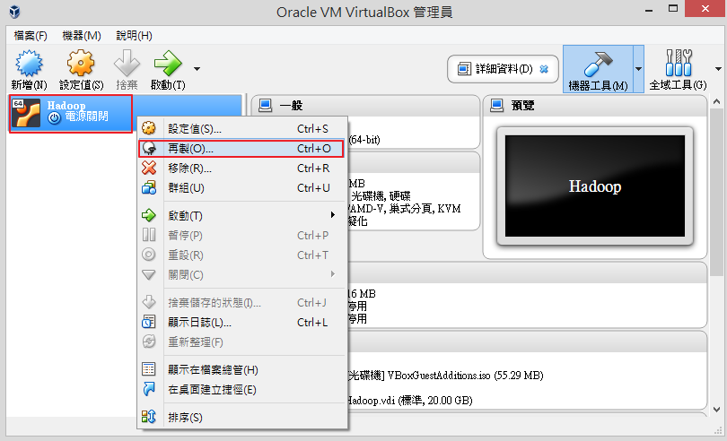

* 設定虛擬主機名稱
  * 輸入虛擬機器名稱 data1
  * 勾選 "初始化所有網路卡的MAC位址(R)"，然後下一步

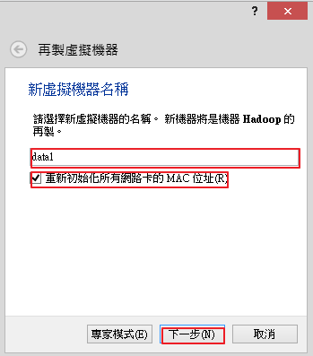

* 設定再製類型
  * 選擇完整再製，然後再製

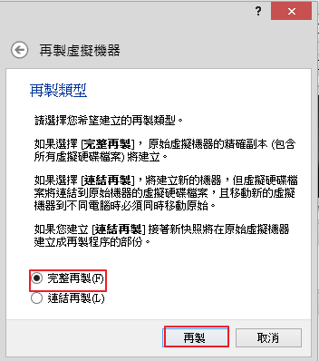

* 再製完成，如下圖


## VirtualBox 介面卡設定 

本次 VirtualBox 介面卡設定如下圖所示:

* 最右邊為我的電腦(windows)，前幾章已經在電腦裡安裝 VirtualBox 的虛擬主機軟體，然後我們在 VirtualBox 上面建立四台虛擬主機，分別為 master、data1、data2、data3
* 在每一台虛擬主機都設定兩張介面卡
    * 介面卡一:可以透過 Host 主機連結至外部網路
    * 介面卡二:設定為 "內部網路介面卡"，用於建立內部網路，內部網路連結虛擬主機(master、data1、data2、data3)

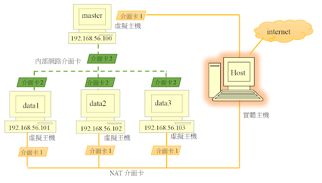

* 設定介面卡
  * 點選 data1 虛擬機
  * 點選設定值
  * 點選網路
  * 介面卡1
    * 選擇 "NAT" 介面卡
  * 介面卡2
    * 點選 "啟動網路卡"
    * 選擇內部網路
  * 最後點選確認  

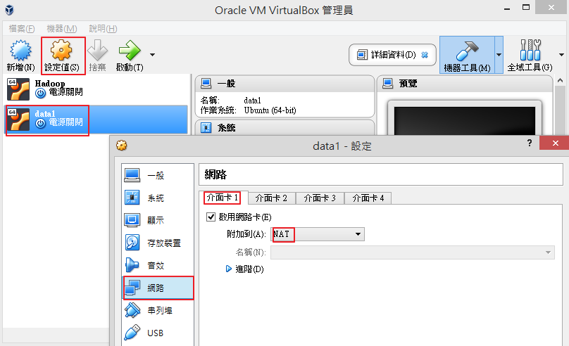

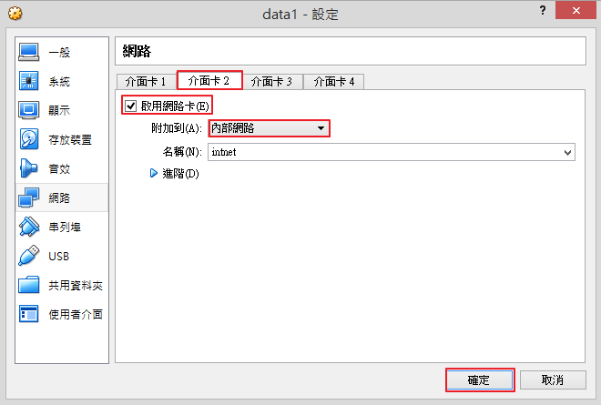


## 設定 data1 伺服器 

設定 Muti Node Cluster 伺服器，組態設定檔共通部分:固定 ip、hostname、core-site.xml、yarn-site.xml、mapred-site.xml、hdfs-site.xml。

* 啟動 data1 伺服器
  * 點選 data1 伺服器，然後啟動

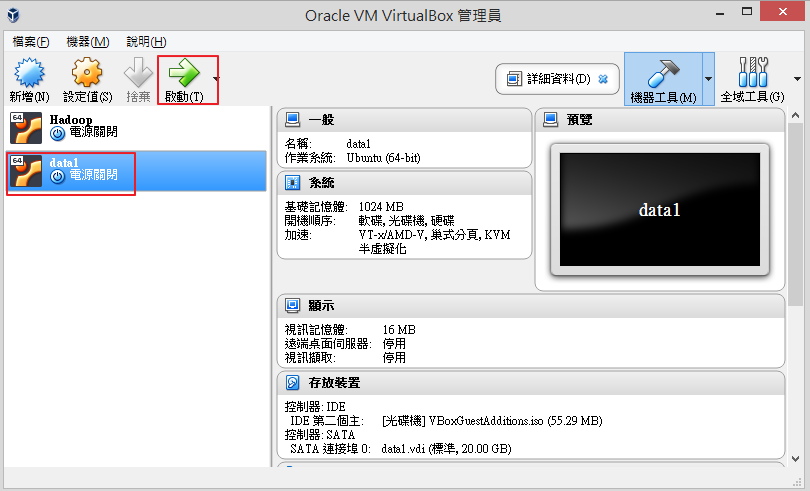

* 在 data1 終端機執行下列指令，設定 data1 虛擬主機每次開機都是使用固定 IP:192.168.56.101

```
sudo gedit /etc/network/interfaces
```

* 執行完指令會開啟 interfaces 檔案，輸入下圖紅框內容，然後儲存，離開
  * 設定介面卡 1 (上方紅框)
    * 設定為 "NAT 介面卡"，可以透過 Host 主機連結至外部網路，設定為 enp0s3，並且設定 dhcp 自動取得 ip 位址
  * 設定介面卡 2 (下方紅框)
    * 設定為 "內部網路介面卡"，用於建立內部網路，內部網路連結虛擬主機(master、data1、data2、data3) 與 Host 主機。設定為 enp0s8，並且設定 static 指定固定 ip 位址

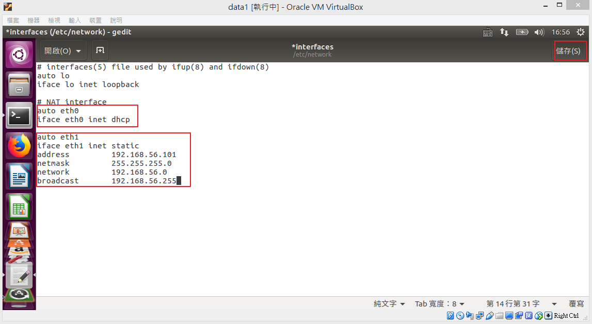

* 設定 hostname
  * 設定 data1 的 HOSTNAME (主機名稱)，如下指令

```
sudo gedit /etc/hostname
```

* 執行完指令會開啟 hostname 檔案，輸入下圖紅框內容，然後儲存，離開

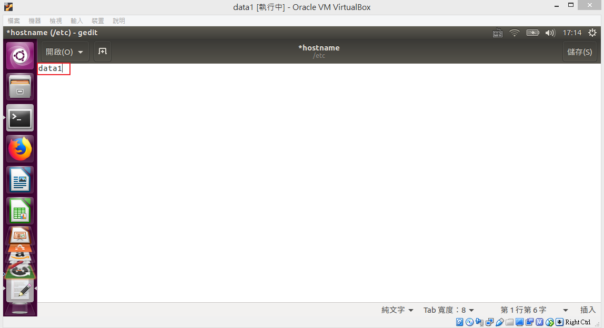

* 設定 hosts 檔案，輸入如下指令
  * hosts 檔案通常用來補充或取代網路中的 DNS 的功能。和 DNS 不同的是電腦使用者可以直接對 hosts 檔案進行控制。hosts 檔案可儲存電腦網路中各節點資訊，負責將主機名稱對映到相對應的 IP 位址

```
sudo gedit /etc/hosts
```

* 執行完指令會開啟 hosts 檔案，輸入下圖紅框內容(每一台主機對應的 IP)，然後儲存，離開

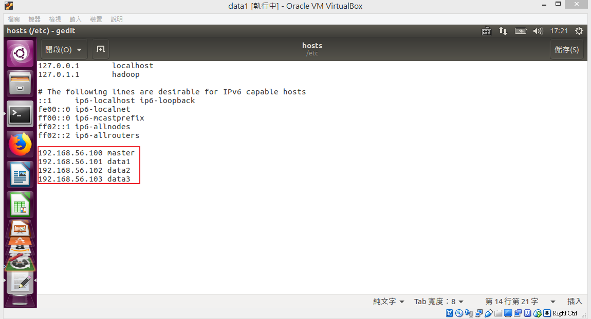

* 編輯 core-site.xml
  * 後續如果使用程式讀取 HDFS 時，會使用 hdfs://master:900 這個位址來存取 HDFS，指令如下

```
sudo gedit /usr/local/hadoop/etc/hadoop/core-site.xml
```

* 執行完指令會開啟 core-site.xml 檔案，將下圖紅框內容 localhost 改成 master，然後儲存，離開

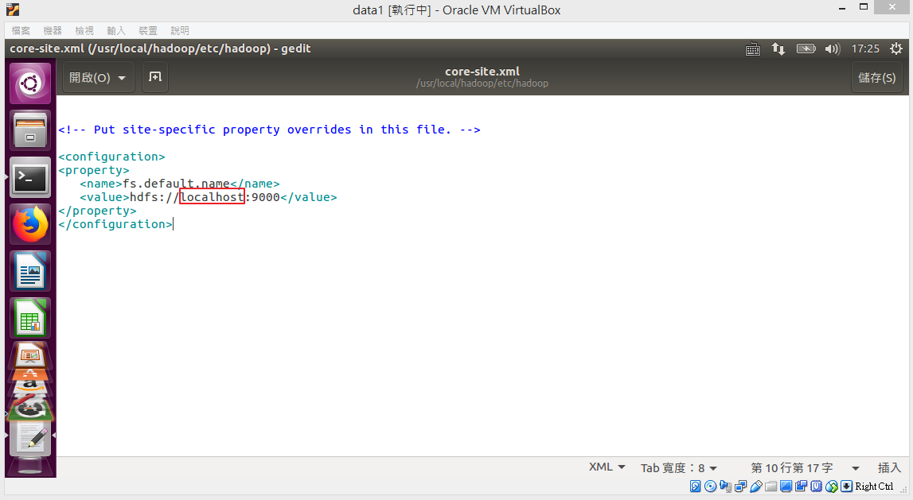

* 編輯 yarn-site.xml
  * yarn-site.xml 檔案功能是 MapReduce2(YARN) 相關的組態設定，指令如下

```
sudo gedit /usr/local/hadoop/etc/hadoop/yarn-site.xml
```

* 執行完指令會開啟 yarn-site.xml 檔案，輸入下圖紅框內容(在 "configuration"之間)，然後儲存，離開
  * ResourceManager 主機與 NodeManager 的連接位址 8025
  * ResourceManager 與 ApplicationMaster 的連接位址 8030
  * ResourceManager 與客戶端的連接位址 8050


* 編輯 mapred-site.xml 
  * mapred-site.xml 用於設定監控 Map 與 Reduce 程式的 JobTracker 工作分配狀況，以及 TaskTracker 工作執行狀況，指令如下

```
sudo gedit /usr/local/hadoop/etc/hadoop/mapred-site.xml
```

* 執行完指令會開啟 mapred-site.xml 檔案，修改成下圖紅框內容(在 "configuration"之間)，然後儲存，離開

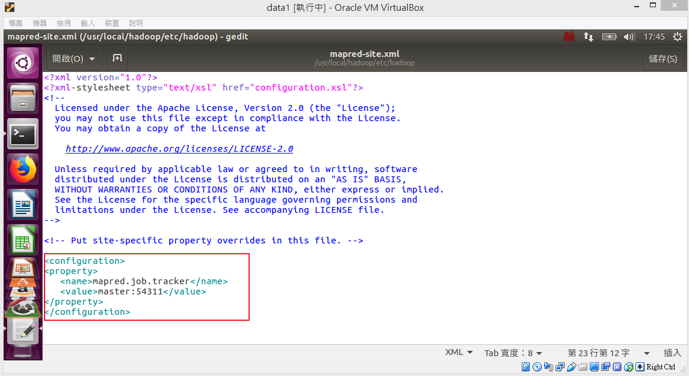


* 編輯 hdfs-site.xml 
  * hdfs-site.xml 用於設定 HDFS 分散式檔案系統相關組態設定。之前在 Single Node Cluster 因為只有一台伺服器，所以同時身兼 NameNode 與 DataNode 角色。但 data1 現在只是單存 DataNode，所以請移除 NameNode 設定，只保留 DataNode 設定，指令如下
  
```
sudo gedit /usr/local/hadoop/etc/hadoop/hdfs-site.xml
```

* 執行完指令會開啟 hdfs-site.xml 檔案，修改成下圖紅框內容(在 "configuration"之間)，然後儲存，離開

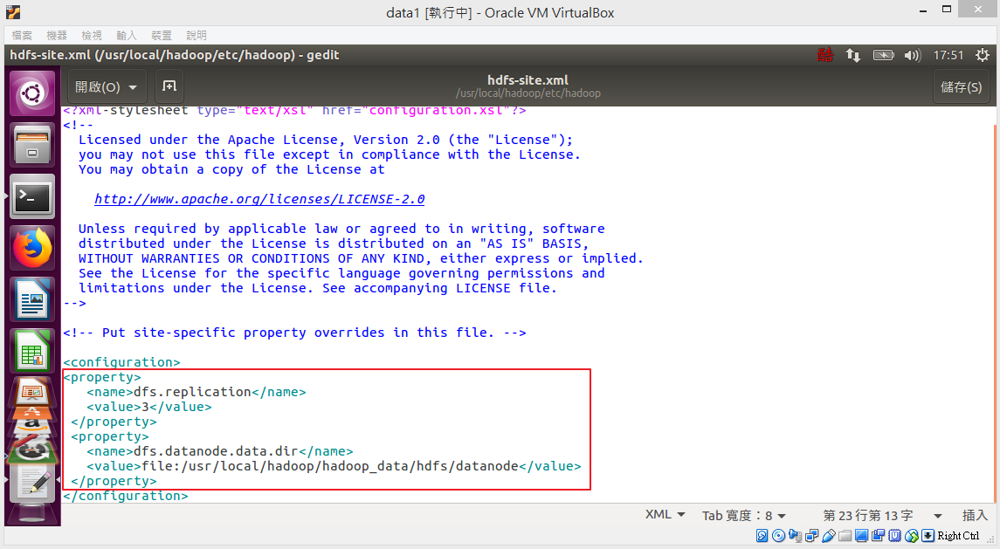

* data1 重新啟動，確認網路設定
  * 重新啟動之後在 data1 終端機輸入如下指令

```
ifconfig
```

* 執行完指令會看到共有兩張介面卡 enp0s3 與 enp0s8，並且內部 ip 是 192.168.56.101

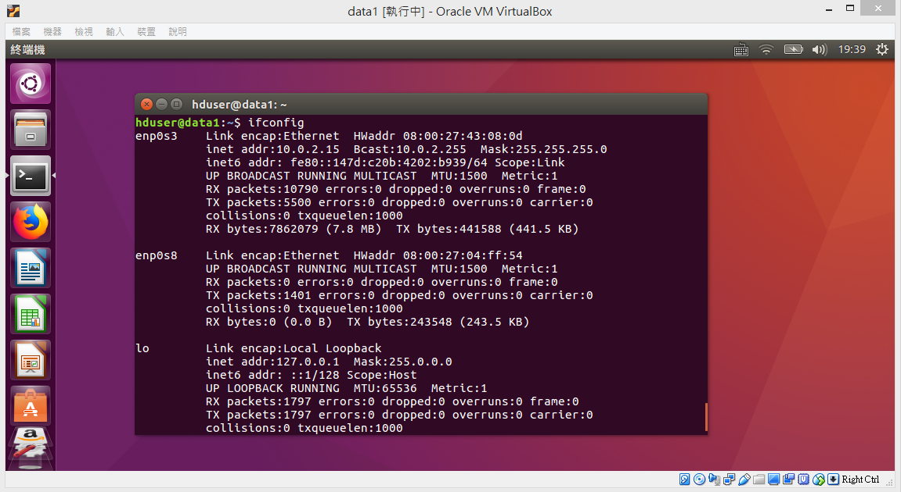


* data 1 虛擬機器關機
  * 因為要複製 data 1 給 data 2、data 3、master，所以要先關機 


## 複製 data1 伺服器至 data2、data3、master

由於之前 data1 已經設定好 Hadoop Multi Node Cluster 共通的部分，所以直接複製 data1 到 data2、data3、master。

* data1 複製到 data2

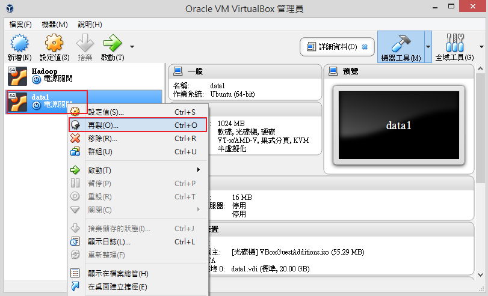

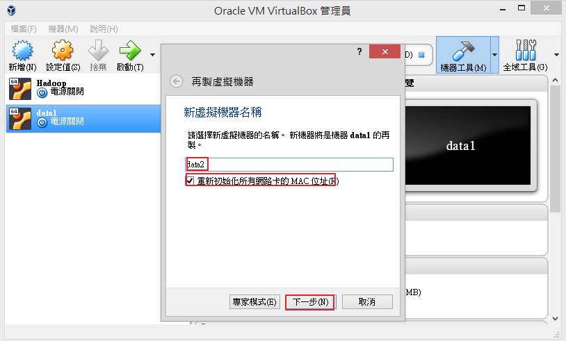

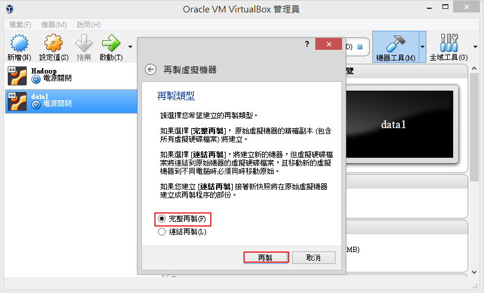

* 重複上述步驟依序將 data3、master 複製出來。完成如下圖所示。

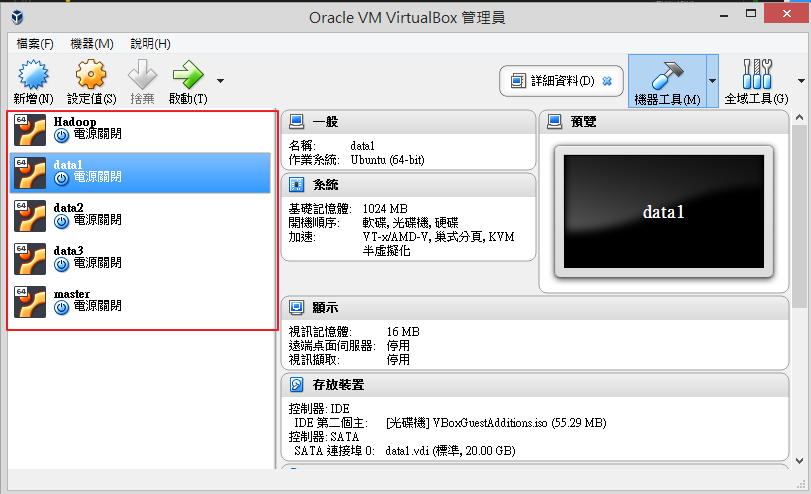

* 虛擬機器記憶體設定
  * 設定虛擬機器的記憶體主要是依照 host 實體主機 (PC 或伺服器) 記憶體大小決定:
    * 實體記憶體是 16G，建議設定為 master:4G、data1:2G、data2:2G、data3:2G
    * 實體記憶體是 8G，建議設定為 master:2G、data1:1G、data2:1G、data3:1G
    * 實體記憶體是 4G，建議只使用 Single Node Cluster:2G
  * 如果設定虛擬機器的總記憶體大於 host 實體主機記憶體大小，可能會造成實體主機當機
  * 按照下圖將 data1、data2、data3、master 記憶體設定完成

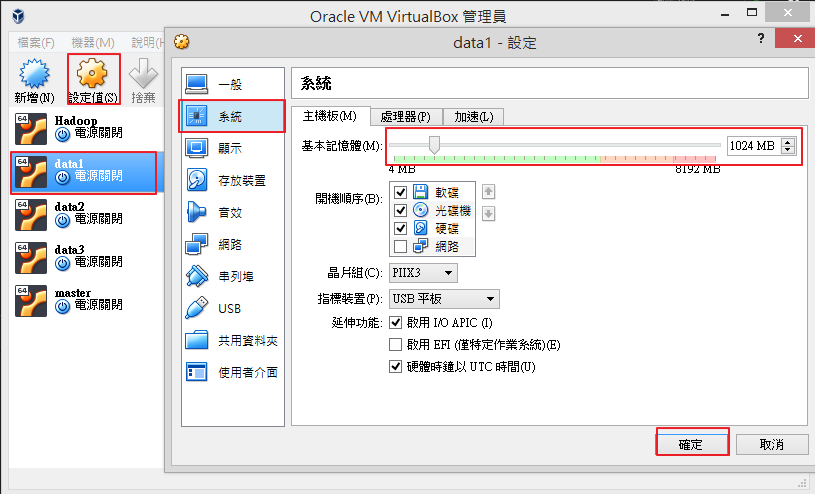


## 設定 data2 伺服器

* 啟動 data2 虛擬機器，如下圖所示

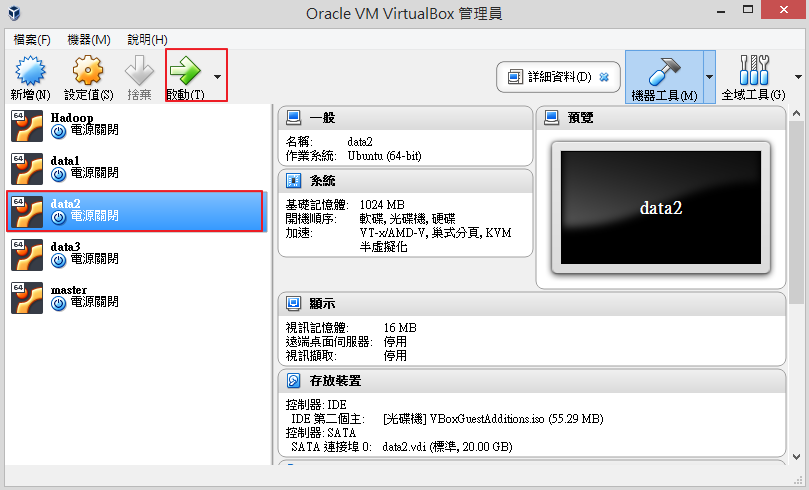

* 設定 data2 固定 IP
  * 設定 data2 虛擬主機每次開機使用固定 IP:192.168.56.102
  * 在 data2 終端機，執行下列指令
  * 修改紅框處為 192.168.56.102，然後儲存、關閉

```
sudo gedit /etc/network/interfaces
```

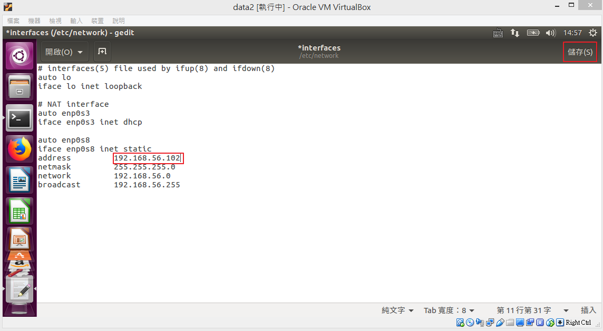

* 編輯 hostname 檔案
  * 執行下列指令，修改紅框處為 data2，然後儲存、關閉

```
sudo gedit /etc/hostname
```

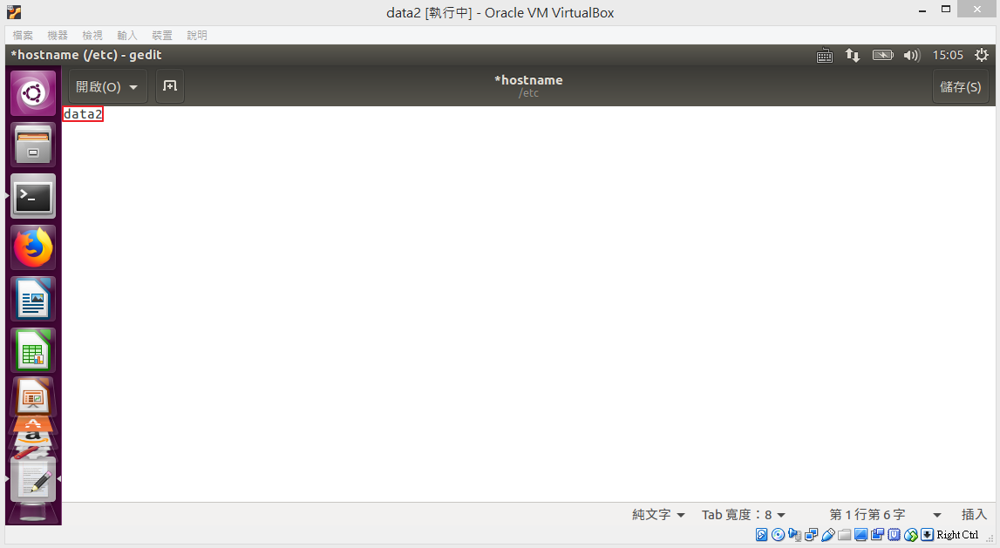

* 重新啟動 data2 虛擬機器，確認網路設定
  * 重新啟動之後在 data2 終端機輸入如下指令

```
ifconfig
```

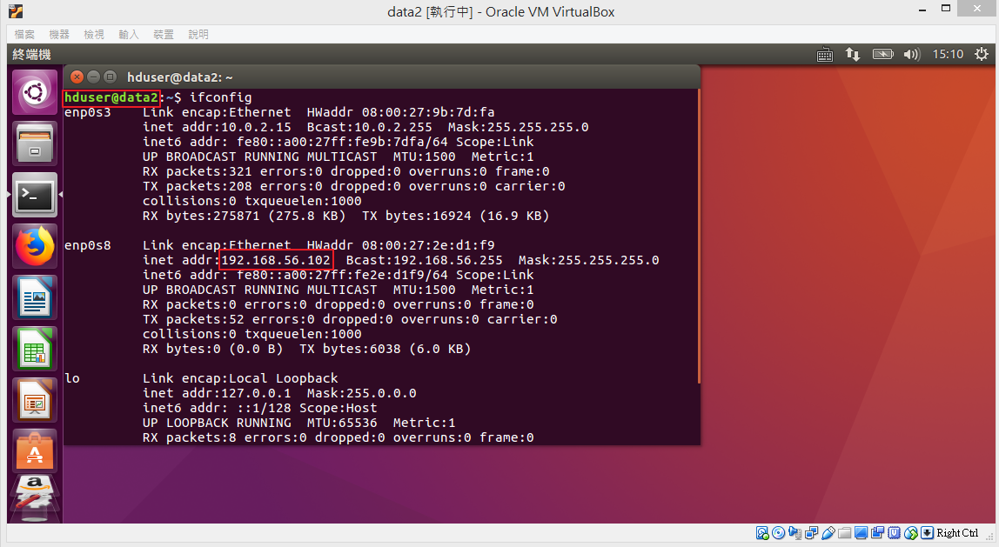

## 設定 data3 伺服器

* 啟動 data3 虛擬機器，做法跟 data2 一樣

* 設定 data3 固定 IP
  * 設定 data3 虛擬主機每次開機使用固定 IP:192.168.56.103
  * 在 data3 終端機，執行下列指令
  * 修改內容為 192.168.56.103，然後儲存、關閉

```
sudo gedit /etc/network/interfaces
```

* 編輯 hostname 檔案
  * 執行下列指令，修改內容處為 data3，然後儲存、關閉

```
sudo gedit /etc/hostname
```

* 重新啟動 data3 虛擬機器，確認網路設定
  * 重新啟動之後在 data3 終端機輸入如下指令

```
ifconfig
```

## 設定 master 伺服器

* 啟動 master 虛擬機器，做法跟之前一樣

* 設定 master 固定 IP
  * 設定 master 虛擬主機每次開機使用固定 IP:192.168.56.103
  * 在 master 終端機，執行下列指令
  * 修改內容為 192.168.56.100，然後儲存、關閉

```
sudo gedit /etc/network/interfaces
```

* 編輯 hostname 檔案
  * 執行下列指令，修改內容處為 master，然後儲存、關閉

```
sudo gedit /etc/hostname
```

* 設定 hdfs-site.xml
  * hdfs-site.xml 用於設定 HDFS 分散式檔案系統相關組態設定。因為 master 現在只是單純 NameNode，請移除 DataNode 的 HDFS 設定，並加入 NameNode 的 HDFS 設定。
  * 輸入如下指令，修改紅框處為 namenode，然後儲存、關閉
 
```
sudo gedit /usr/local/hadoop/etc/hadoop/hdfs-site.xml
```


* 編輯 masters 檔案
  * masters 檔案主要是告訴 hdoop 系統那一台伺服器是 NameNode
  * 輸入如下指令，修改紅框處為 master，然後儲存、關閉

```
sudo gedit /usr/local/hadoop/etc/hadoop/masters
```  

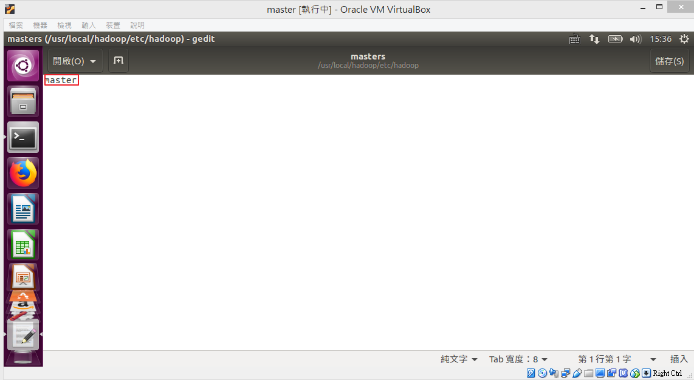

* 編輯 slaves 檔案
  * slaves 檔案主要是告訴 hadoop 系統那些伺服器是 DataNode
  *  輸入如下指令，新增紅框處內容，然後儲存、關閉

```
sudo gedit /usr/local/hadoop/etc/hadoop/slaves
```  

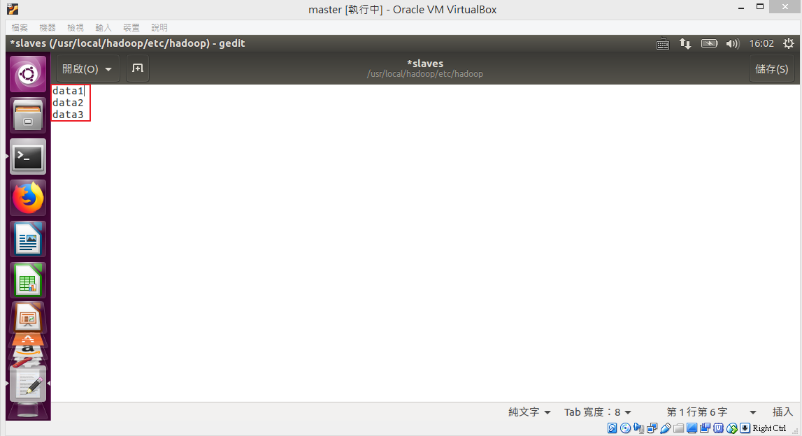

* 重新啟動 master 虛擬機器，確認網路設定
  * 重新啟動之後在 master 終端機輸入如下指令

```
ifconfig
```


## master 連線至 data1、data2、data3 建立 HDFS 目錄


## 建立與格式化 NameNode HDFS 目錄


## 啟動 Hadoop Multi Node cluster


## 開啟 Hadoop Resource-Manager Web 介面


## 開啟 NameNode Web 介面