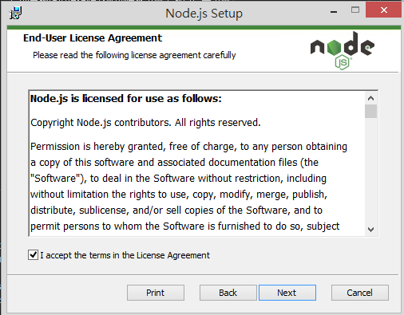
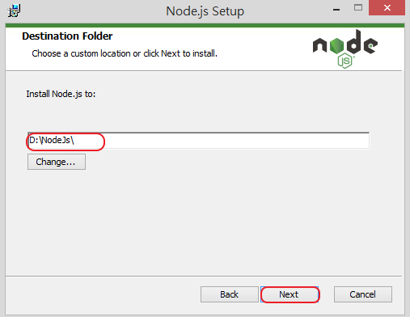
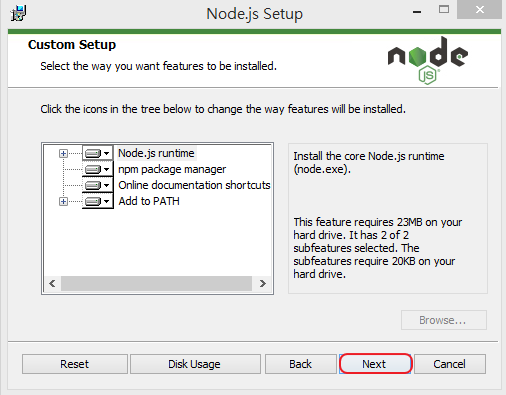
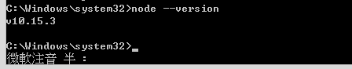

# 安裝 Node.js 並設定環境

Node.js 就是執行在服務端的 JavaScript。Node.js 是一個基於 Chrome V8 引擎的 JavaScript 執行環境。Node.js 使用了一個事件驅動、非阻塞式 I/O 的模型，使其輕量又高效。Node.js 的包管理器 npm，是全球最大的開源庫生態系統。

## Windows 下安裝 Node.js

Step1: [Node.js 下載](https://nodejs.org/zh-tw/download/)，根據自己的電腦環境選擇相對應的檔案下載，我自己是下載 node-v10.15.3-x64.msi

Step2: 點擊下載的安裝檔安裝，然後如下圖所示:

  

  

選擇自己要安裝的目錄

  

  

Step3: 檢查是否已經安裝，打開 cmd，執行如下指令:

```
node --version
```

如出現如下圖字樣，即表示安裝完成
  