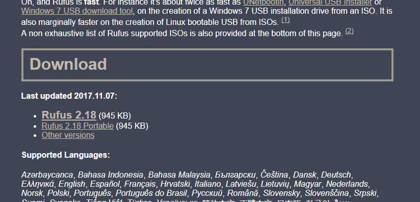
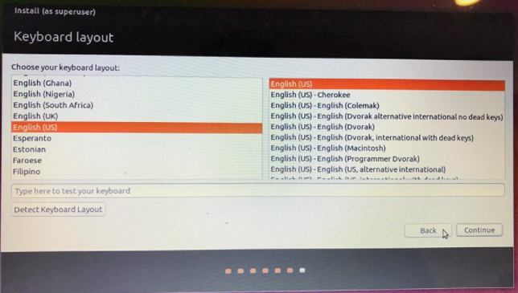
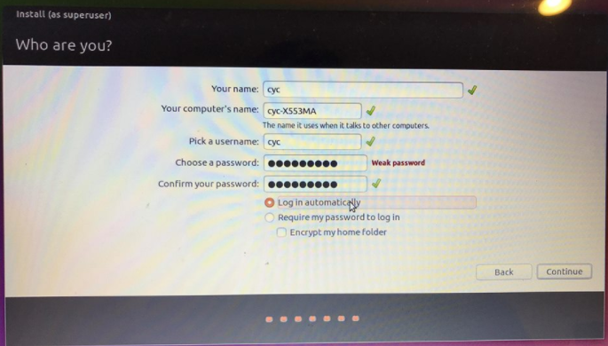
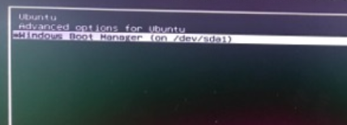

# 安裝 Ubuntu System

## Windows Subsystem for Linux (WSL)

在 windows 10 之後可以在 window 上建立 subsystem，尤其是 linux 系統，更方便 dev 開發

### [介紹好用工具：WSL (Windows Subsystem for Linux)](https://blog.miniasp.com/post/2019/02/01/Useful-tool-WSL-Windows-Subsystem-for-Linux)

## 安裝 Ubuntu 16.04.3 LTS

Linux distribution 下有分很多種 UI，比如:

- CentOS
- Debian
- Mint
- Ubuntu
- 等等

在這我們挑選一個比較被廣泛使用的 Ubuntu 來安裝。

### Download Ubuntu

一般來說 Linux 都會選擇英文版的來安裝，如果特別喜歡中文版的，可以在 google 尋找。下面是 Ubuntu 英文版本的載點。

- [Ubuntu 英文系統](https://www.ubuntu.com/download/desktop)

 

下载好以後 (大概1.5GB), 會有一個文件名稱類似 ubuntu-16.04.3-desktop-amd64.iso ，這就是 Ubuntu 的桌面版安装文件。接著我们將這文件放進事先準備好的 USB 或外接硬碟。

### 使用 USB 安装 Ubuntu

因為大部分使用者都是 Windows 轉 Ubuntu, 所以下面的解說都是基於 Windows，另外想要看更仔細的說明可以參考 [官方版 Ubuntu USB 安装說明](https://tutorials.ubuntu.com/tutorial/tutorial-create-a-usb-stick-on-windows?_ga=2.242174530.1746861324.1507700161-1586045268.1507700161#0)。

**USB 安裝要求**

- 2GB 或更大的 USB (或外接硬碟)。 有一點要注意的是你的 USB 會被清空，所以請備份裡面的文件。
- 官方推薦使用 [Rufus](https://rufus.akeo.ie/)， Rufus 是一套免費、中文化、免安裝、操作簡單、製作速度快的將ISO光碟映像檔製作為 USB 開機隨身碟的軟體，簡單說就是一個將 Ubuntu OS 轉換到 USB 的免費軟體。

直接點選 Rufus 連結，找到 Download，點選第一個連結下載，由於 Rufus 可能會一直更新，所以畫面版本可能會有些許不同。 

 

- 開啟 Rufus
- 插上 USB
- 第一個紅色框框會顯示 USB 名稱，如果沒有會有下拉選單可以選，然後選擇你的 USB
- 第二個紅色框框擇點選剛剛下載好的 ubuntu-16.04.3-desktop-amd64.iso 桌面安裝文件，然後直接執行

 

在執行的過程中可能會遇到一些狀況

 

 

直接選擇是和 ok 即可。最後案離開即可。

**安裝 Ubuntu**

搞定好 USB 相關的操作之後，直接從新啟動電腦，通常需要修改電腦的啟動順 “BIOS”。因為我的電腦是 asus，所以我在開機的時候需要一直狂按 F2 (可能會因為電腦廠牌不同而需要按不同的按鍵，原則上大同小異) 就可以進入 BIOS 設定，然後更改設定成使用 USB 啟動。

另外因為 window8 和 window10 具有快速啟動功能，也就是在關機過程會使電腦保存系統啟動相關部分，以利下次開機時能快速進入系統。但電腦以此方式關機會讓使用者於下次開機時，無法以快捷鍵 F2 進入 BIOS。

如果是使用 window8 和 window10 在關機的時候必須要按住鍵盤的 Shift 鍵不放並點選關機就可以了，下次按下電源鍵開機後，就可以根據上面的操作進入BIOS設定。另外，點選重新啟動，也是可以讓電腦完整的重新啟動，電腦在重新啟動後進入BIOS介面時，使用者也是可以看到進入BIOS設定的提示字眼。

 

完成上述流程，電腦就會使用 USB 啟動，並開啟 Ubuntu 安裝流程。

首先會選擇語言，在中間會有一個步驟是要連接 wifi，連接 wifi 之後在安裝 Ubuntu 會自動裝上一些額外的東西。

 

我在這是只勾選第一個，主要原因是因為可以減少安裝的時間，但之後要用到可能要叫自己安裝。第二個勾勾是在安裝的時候順便幫你安裝其他需要的東西。

接着，你可以選擇安裝雙系統或者清除之前的系統，然後電腦就只有Ubuntu 系統。

- 選 Install Ubuntu alongside Windows Boot Manager 就是雙系統
- 選 Erase disk and install Ubuntu 清除之前的系統再安裝 (危險動作)

如果選了 Install Ubuntu alongside Windows Boot Manager，接下來就是這個界面，你將要選擇要分配多少空間給 Ubuntu 系統。只需要拖動中間的分割線就能分配空間大小了。然後確定安裝就好。

最後就是設置一些你的時區、帳號、密碼等，都很容易，就不多做說明。

當你看到進度條跑完的時候，就大功告成啦。

**開機啟動 Ubuntu**

如果你選的是裝成雙系統，每次開機的時候，你會看到這樣一個界面，讓你來選擇要啟動哪個系統。你可以選 Ubuntu 或者 Windows。

### VirtualBox 5.2 安裝 Ubuntu 16.04 與 Windows 8 共用資料夾

http://blog.xuite.net/yh96301/blog/76237032-VirtualBox+5.2%E5%AE%89%E8%A3%9DUbuntu+16.04%E8%88%87Windows+10%E5%85%B1%E7%94%A8%E8%B3%87%E6%96%99%E5%A4%BE

## Ubuntu 18.04 link OneDrive

- [OneDrive](https://www.maketecheasier.com/sync-onedrive-linux/)

## 常用 Tool

- [WSL 設定 Z shell (zsh)](https://poychang.github.io/note-windows-terminal/)
    - 由於 windows 會有些符號無法顯示zsh部分字型或圖案(windows 字型比較少，在 windows 多安裝 Powerline 就可以)，所以我選擇主題 bira，比較方便
    - 之後要修改就改 ~/.zshrc 檔案